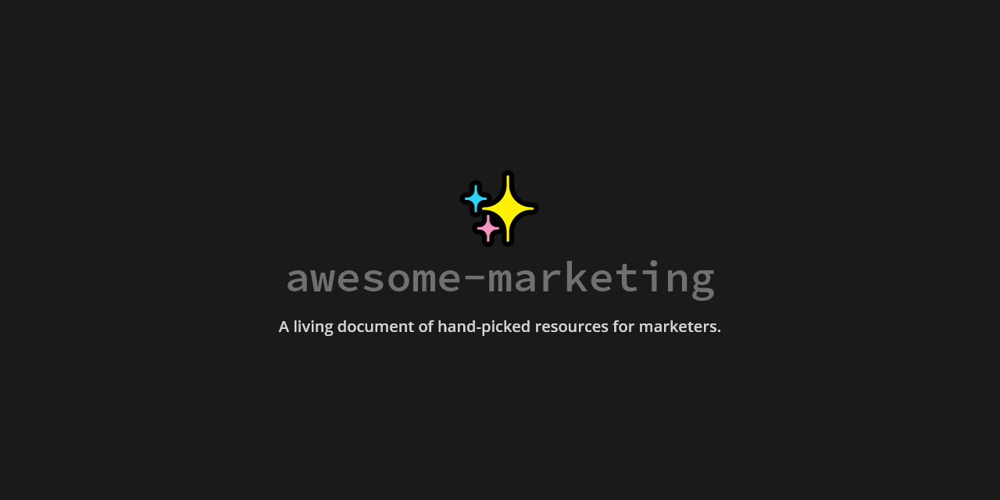

# awesome-marketing

A living document of hand-picked resources for marketers, or I bookmark too much crap and forget which folder they're in.

## Contents

- [Blogs and Websites](#blogs-and-websites)
- [Books](#books)
- [Content Marketing](#content-marketing)
- [CRM](#crm)
- [Design Inspiration](#design-inspiration)
- [Newsletters](#newsletters)
- [Others](#others)
- [Paid Marketing](#paid-marketing)
- [Podcasts](#podcasts)
- [Product Marketing](#product-marketing)
- [SEO](#seo)
- [Strategy](#strategy)
- [Tools](#tools)
- [Tweets](#tweets)

## Blogs and Websites (Personal or Company)

- [Growth Supply](https://growthsupply.com/) - Great writing on startups and growth from Ali Mese
- [Kevin Indig](https://www.kevin-indig.com/) - No-BS long reads on SEO, Content, and Strategy
- [Brian Balfour](https://brianbalfour.com/) - Long Reads on growth and marketing
- [Sixteen Ventures](https://sixteenventures.com/) - Sales acceleration and growth marketing posts
- [Andrew Chen](https://andrewchen.co/) - Long reads on growth and business
- [Better Marketing](https://medium.com/better-marketing)

## Books

- [Everything is Fucked: A Book About Hope by Mark Manson](https://www.amazon.com/Untitled-Mark-Manson/dp/0062888439)
- [Contagious: Why Things Catch On by Jonah Berger](https://jonahberger.com/books/contagious/)
- [Everybody Writes: Your Go-To Guide to Creating Ridiculously Good Content by Ann Handley](https://annhandley.com/everybodywrites/)
- [Permission Marketing by Seth Godin](https://www.amazon.com/Permission-Marketing-Turning-Strangers-Customers/dp/0684856360)
- [Obviously Awesome by April Dunford](https://www.amazon.de/-/en/gp/product/B07PPW5V9C/)
- [Hooked: How to Build Habit-Forming Products by Nir Eyal](https://www.nirandfar.com/hooked/)
- [Buyology: Truth and Lies about Why We Buy by Martin Lindstrom](https://www.amazon.com/Buyology-Truth-Lies-About-Why/dp/0385523890)
- [Purple Cow: Transform Your Business by Being Remarkable by Seth Godin](https://www.amazon.com/Purple-Cow-New-Transform-Remarkable/dp/1591843170)
- [Hug Your Haters: How to Embrace Complaints and Keep Your Customers by Jay Bear](https://www.amazon.com/Hug-Your-Haters-Complaints-Customers-ebook/dp/B00Z8VTP5M)
- [All Marketers Are Liars by Seth Godin](https://www.amazon.com/All-Marketers-are-Liars-Works/dp/1591845335)
- [Originals: How Non-Conformists Move the World by Adam Grant](https://www.amazon.com/Originals-How-Non-Conformists-Move-World/dp/014312885X)
- [Radical Candor by Kim Scott](https://www.amazon.de/-/en/gp/product/1529038340/ref=ppx_od_dt_b_asin_title_s00?ie=UTF8&psc=1)
- [Deep Work by Cal Newport](https://www.amazon.de/-/en/gp/product/0349411905/ref=ppx_od_dt_b_asin_title_s00?ie=UTF8&psc=1)
- [Essentialism: The Disciplined Pursuit of Less by Greg McKeown](https://www.amazon.de/-/en/gp/product/0753555166)
- [Building a StoryBrand by Donald Miller](https://www.amazon.de/-/en/gp/product/1400201837/ref=ppx_yo_dt_b_asin_title_o09_s01?ie=UTF8&psc=1)
- [So Good They Can't Ignore You by Cal Newport](https://www.amazon.de/-/en/gp/product/0349415862/ref=ppx_od_dt_b_asin_title_s01?ie=UTF8&psc=1)
- [Thinking, Fast and Slow by Daniel Kahneman](https://www.amazon.de/-/en/gp/product/0141033576/ref=ppx_od_dt_b_asin_title_s01?ie=UTF8&psc=1)
- [Product Led Growth by Wes Bush](https://productled.com/book/)

## Content Marketing

- [Kevin Indig's 2020 Roundup](https://airtable.com/shrSZRDaZ6VcPZSR7/tblO6IGBOmYbuH9FL?backgroundColor=yellow&viewControls=on) - An Airtable of 225 bookmarks from 2020
- [How Morning Brew's referral program built an audience of 1.5 million subscribers](https://medium.com/the-mission/how-morning-brews-referral-program-built-an-audience-of-1-5-million-subscribers-3315482c1aa5)
- [Content Driven Growth](https://www.lennysnewsletter.com/p/content-driven-growth-strategy) - A great writeup on Content Driven Growth from Lenny's Newsletter, focusing on Hubspot, aHrefs, Intercom, and Slidebean
- [Acquisition Channel Opportunities](https://www.indiehackers.com/post/acquisition-channel-opportunities-content-marketing-google-sheets-fake-reviews-0371eb1356)

## CRM

- [Really Good Emails](https://reallygoodemails.com/) - Email inspiration for every email use case

## Design Inspiration

- [Copper CRM](https://www.copper.com/)
- [Mollie Payments](https://www.mollie.com/en)
- [Heap CRM](https://heap.io/)
- [Miro](https://miro.com/)
- [Loom](https://loom.com/)
- [Taskade](https://taskade.com/)
- [Monday](https://monday.com/)
- [Kong](https://konghq.com/)
- [Metadata](https://metadata.io/)
- [GraphCMS (Shameless Plug)](https://graphcms.com/)
- [Segment](https://segment.com/)
- [Twilio](https://twilio.com/)
- [Algolia](https://algolia.com/)
- [Drip](https://drip.com/)
- [Kajabi](https://kajabi.com/)
- [Proof](https://useproof.com/)
- [Keap](https://keap.com/)
- [Mailchimp](https://mailchimp.com/)
- [Aiva Labs](https://aivalabs.com/)
- [Landbot](https://landbot.io/)
- [Dynamic Yield](https://www.dynamicyield.com/)
- [Pitch](https://pitch.com/)
- [8Base](https://www.8base.com/)

## Newsletters

- [Growth Newsletter by Julian Shapiro](https://www.demandcurve.com/newsletter)
- [Hitenism by Hiten Shah](https://hitenism.com/)
- [Growth Memo by Kevin Indig](https://www.kevin-indig.com/)
- [Marketing Weekly by Corey Haines](https://app.mailbrew.com/coreyhainesco/marketing-weekly-WV3pZMdwsL29)

## Others

- [Kevan Lee's Interview Prep](https://kevanlee.substack.com/p/206-interview-prep-) - list of resources for marketing interviews
- [Amir Shevat on Measuring Developer Relations](https://dev.to/swyx/notes-from-amir-shevat-on-measuring-managing-developer-relations-4geo) - a16z podcast on DevRel management
- [Kevin Indig's Good Reads](https://www.kevin-indig.com/good-reads/) - List of articles, books, and videos recommended by Kevin Indig
- [The Unicornian](https://www.theunicornian.io/) - The onion for startups?
- [How to Find Product Market Fit](https://www.youtube.com/watch?v=_6pl5GG8RQ4) - Peter Reinhardt (Segment) talk at Y Combinator
- [Letter to a new Startup CMO](https://www.lenmarkidan.com/members/posts/46760-letter-to-a-new-startup-cmo)
- [Reframing Headless CMS](https://www.episerver.com/articles/reframing-headless-cms)
- [Books people (re)read](https://rauchg.com/2020/books-people-reread)
- [Welcome to your bland new world](https://www.bloomberg.com/opinion/articles/2020-09-07/welcome-to-your-bland-new-world-of-consumer-capitalism?utm_source=morning_brew)
- [Community First, Product Second](https://www.producthunt.com/stories/community-first-product-second)

## Paid Marketing

- 😶

## Podcasts

- [The Tim Ferriss Show by Tim Ferriss](https://tim.blog/podcast/)
- [Pivot by Scott Galloway and Kara Swisher](https://player.fm/podcasts/Scott-Galloway)
- [The Prof G Show by Scott Galloway](http://www.westwoodonepodcasts.com/pods/the-prof-g-show-with-scott-galloway/)
- [Everyone Hates Marketers by Louis Grenier](https://www.everyonehatesmarketers.com/)
- [This Old Marketing Podcast by Joe Pulizzi and Robert Rose](https://contentmarketinginstitute.com/pnr-with-this-old-marketing-podcast/)
- [Perpetual Traffic by Ralph Burns and Amanda Powell](https://digitalmarketer.com/podcast/perpetual-traffic/)
- [Online Marketing Made Easy by Amy Porterfield](https://amyporterfield.com/amy-porterfield-podcast/)
- [Marketing Scoop by Laura Morelli](https://semrush.com/podcast/)
- [Marketing Over Coffee by John J. Wall and Christopher S. Penn](https://marketingovercoffee.com/)
- [Copyblogger FM by Darrell Vesterfelt and Curt Nickisch](https://rainmaker.fm/series/lede/)
- [Growth Mapping by Sujan Patel and Aaron Agius](https://growthmappingpodcast.com/)
- [Masters of Scale by Reid Hoffmann](https://mastersofscale.com/)
- [Entrepreneurs on Fire by John Lee Duma](https://www.eofire.com/podcast/)

## Product Marketing

- [Product Marketing Reading List](https://productmarketingalliance.com/your-definitive-product-marketing-reading-list/) - A reading list of PMM books by the PMA
- [What is Product Marketing?](https://setapp.com/business/what-is-product-marketing)
- [How to build a successful Go To Market Strategy](https://www.process.st/go-to-market-strategy/)

## SEO

- [SEO Community](https://seo-community.org/) - Public domain project listing resources for SEO.
- [ahrefs SEO trends for 2021](https://ahrefs.com/blog/seo-trends/)
- [Learning SEO](https://learningseo.io/) - Free SEO learning roadmap with tons of resources
- [How does SEO Work?](https://learn.g2.com/how-does-seo-work) - G2 article on the basics of SEO
- [Search Engine Land](https://searchengineland.com/)
- [How Airtable’s Long Tail SEO Strategy Is Helping Build Their Moat](https://foundationinc.co/lab/long-tail-seo-strategy/)

## Strategy and Growth

- [Difference between SLG, MLG, and PLG](https://blog.close.com/product-led-sales-led-marketing-led/)
- [Growth Marketing Summit: Marketing with Speed and Data](https://valchanova.me/growth-marketing-summit)
- [25 Growth Strategies](https://mashable.com/2017/11/07/influencer-markting-tips-tricks-25-most-influential/)
- [Growth as a Mindset](https://debliu.substack.com/p/growth-as-a-mindset)
- [The Product Strategy Stack](https://www.reforge.com/blog/the-product-strategy-stack)
- [Systems Thinking 101](https://www.kevin-indig.com/growth-memo/systems-thinking-101/)

## Tools

- [The 2021 Marketing Tech Stack](https://www.intercom.com/blog/the-ultimate-marketing-technology-stack) - Recommended stack from Intercom
- [MarTech Base](http://martechbase.com/) - Resource for building stacks and seeing who's using what
- [Build Your DXP](https://buildyourdxp.com) - Community durated list of API-first tools for Martech stacks
- [What's your Marketing Stack?](https://www.reddit.com/r/marketing/comments/55myuq/whats_your_complete_marketing_stack/)

## Tweets

- [When doing customer research, don't ask your customer for their OPINION — get them to tell you STORIES.](https://twitter.com/KateBour/status/1292101482293211137)
- [Top Marketers in SaaS](https://twitter.com/coreyhainesco/status/1304794143063826432)
- [The first line of your copy is crucial.](https://twitter.com/GoodMarketingHQ/status/1344671219057090562)
- [10 ideas that changed my life: (thread)](https://twitter.com/jackbutcher/status/1345081536295669760)
- [Turn any SERP into a keyword research tool](https://twitter.com/Kammie_Jenkins/status/1349753139612639236)
- [2020 Best Campaigns we didn't create](https://twitter.com/ichbinGisele/status/1351274398314090498)
- [10 Questions for Teasing Out Market Opportunities](https://twitter.com/derrickreimer/status/1353072467435081733)
- [Digital PR for SEO Rankings](https://twitter.com/_spamtaylor/status/1354179118120775689)
- [How to Grow Startups](https://twitter.com/Julian/status/1353764328030130179)
- [Simple Copywriting](https://twitter.com/VeryGoodCopy/status/1356643717562703872)
- [100 Landing Page Hot Tips](https://twitter.com/robhope/status/1265278107088347136)
- [Mapping the Creator Economy](https://twitter.com/trengriffin/status/1358980425230610439)
- [Marketing to Developers](https://twitter.com/swyx/status/1361279902889086980)
- [Best Threads on Twitter](https://twitter.com/jmoserr/status/1360014458962075648)
- [Marketing Framework for Communities](https://twitter.com/gregisenberg/status/1363174620912885761)
- [How to determine value of backlinks](https://twitter.com/jmoserr/status/1364605133347151877)
- [The SaaS Board Meeting](https://twitter.com/DavidSacks/status/1367532639247163392)
- [Oatly case study](https://twitter.com/kevinleeme/status/1286716796448301057)
- [Uncommon SEO Knowledge](https://twitter.com/patrickstox/status/1292484953503158275)
- [M&A Marketing and Acquiring Communities](https://twitter.com/coreyhainesco/status/1369123488867389440)
- [Community Capitalism](https://twitter.com/charlierward/status/1368591361864241157)
- [Marketing to Developers and building developer relations](https://twitter.com/swyx/status/1367518496326709251)
- [Turning opinions into marketing proof](https://twitter.com/thinking_slow/status/1366433850994397184)
- [Building a Community from Scratch](https://twitter.com/mkobach/status/1254918328516333574)
- [Best SaaS Company Blogs](https://twitter.com/dr/status/1370002350614618116)
- [Founder "Types", and how to hire accordingly](https://twitter.com/msuster/status/1373332637029298177)