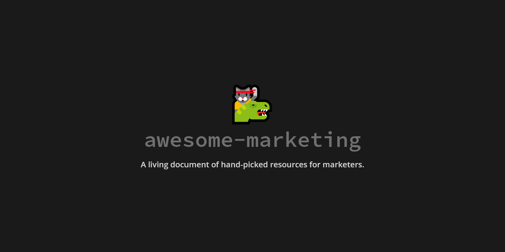

# awesome-marketing

A living document of hand-picked resources for marketers (or, I bookmark too many things to read and forget which folder they're in).

🚧 Very much still a work in progress 🚧

I also have another list of [awesome-developer-marketing](https://github.com/ronakganatra/awesome-developer-marketing) resources.

Why am I turning my bookmarks into a public repo? The problem with marketing related content online is that it's 99% crap and fluff. I try to read a lot and save my resources. So I thought I might as well make it public, so you can save yourself some time trying to find things worth reading.

# Blogs and Websites (Personal or Company)

- [Growth Supply](https://growthsupply.com/) - Great writing on startups and growth from Ali Mese
- [Kevin Indig](https://www.kevin-indig.com/) - No-BS long reads on SEO, Content, and Strategy (⭐)
- [Brian Balfour](https://brianbalfour.com/) - Long Reads on growth and marketing
- [Sixteen Ventures](https://sixteenventures.com/) - Sales acceleration and growth marketing posts
- [Andrew Chen](https://andrewchen.co/) - Long reads on growth and business (⭐)
- [Better Marketing](https://medium.com/better-marketing)

# Books

- [Everything is Fucked: A Book About Hope by Mark Manson](https://www.amazon.com/Untitled-Mark-Manson/dp/0062888439) (⭐)
- [Contagious: Why Things Catch On by Jonah Berger](https://jonahberger.com/books/contagious/)
- [Everybody Writes: Your Go-To Guide to Creating Ridiculously Good Content by Ann Handley](https://annhandley.com/everybodywrites/)
- [Permission Marketing by Seth Godin](https://www.amazon.com/Permission-Marketing-Turning-Strangers-Customers/dp/0684856360)
- [Obviously Awesome by April Dunford](https://www.amazon.de/-/en/gp/product/B07PPW5V9C/)
- [Hooked: How to Build Habit-Forming Products by Nir Eyal](https://www.nirandfar.com/hooked/)
- [Buyology: Truth and Lies about Why We Buy by Martin Lindstrom](https://www.amazon.com/Buyology-Truth-Lies-About-Why/dp/0385523890)
- [Purple Cow: Transform Your Business by Being Remarkable by Seth Godin](https://www.amazon.com/Purple-Cow-New-Transform-Remarkable/dp/1591843170)
- [Hug Your Haters: How to Embrace Complaints and Keep Your Customers by Jay Bear](https://www.amazon.com/Hug-Your-Haters-Complaints-Customers-ebook/dp/B00Z8VTP5M)
- [All Marketers Are Liars by Seth Godin](https://www.amazon.com/All-Marketers-are-Liars-Works/dp/1591845335)
- [Originals: How Non-Conformists Move the World by Adam Grant](https://www.amazon.com/Originals-How-Non-Conformists-Move-World/dp/014312885X)
- [Radical Candor by Kim Scott](https://www.amazon.de/-/en/gp/product/1529038340/ref=ppx_od_dt_b_asin_title_s00?ie=UTF8&psc=1)
- [Deep Work by Cal Newport](https://www.amazon.de/-/en/gp/product/0349411905/ref=ppx_od_dt_b_asin_title_s00?ie=UTF8&psc=1)
- [Essentialism: The Disciplined Pursuit of Less by Greg McKeown](https://www.amazon.de/-/en/gp/product/0753555166) (⭐)
- [Building a StoryBrand by Donald Miller](https://www.amazon.de/-/en/gp/product/1400201837/ref=ppx_yo_dt_b_asin_title_o09_s01?ie=UTF8&psc=1)
- [So Good They Can't Ignore You by Cal Newport](https://www.amazon.de/-/en/gp/product/0349415862/ref=ppx_od_dt_b_asin_title_s01?ie=UTF8&psc=1)
- [Thinking, Fast and Slow by Daniel Kahneman](https://www.amazon.de/-/en/gp/product/0141033576/ref=ppx_od_dt_b_asin_title_s01?ie=UTF8&psc=1)
- [Product Led Growth by Wes Bush](https://productled.com/book/)
- [Crossing the Chasm: Marketing and Selling High-Tech Products to Mainstream Customers by Geoffrey A. Moore](https://www.amazon.com/Crossing-Chasm-Marketing-High-Tech-Mainstream/dp/0887307175/ref=sr_1_1)
- [Hit Refresh: The Quest to Rediscover Microsoft's Soul and Imagine a Better Future for Everyone by Satya Nadella](https://www.amazon.com/Hit-Refresh-Rediscover-Microsofts-Everyone-ebook/dp/B01HOT5SQA) (⭐)

# Case Studies

- [WhatsApp, The Anti-Marketing Growth Phenomenon](https://community.growthhackers.com/posts/whatsapp-the-anti-marketing-growth-phenomenon)
- [Duolingo, The antithesis to the bazaar](https://nibnalin.me/dust-nib/duolingo-the-antithesis-to-the-bazaar.html)
- [The SEO-driven user acquisition behind Zapier's growth to $35M ARR](https://www.reforge.com/brief/the-seo-driven-user-acquisition-behind-zapier-s-growth-to-35m-arr#mRAkHHpXXWEKLo3aqVW-MQ)
- [From PPC to IPO: How Snowflake Did It](https://foundationinc.co/lab/snowflake-ipo)
- [How Notion Built A $2B SaaS Startup Through Community & Templates](https://foundationinc.co/lab/notion-strategy)
- [How Microsoft crushed Slack](https://www.platformer.news/p/how-microsoft-crushed-slack)
- [How Burger King Used FIFA 20 To Turn a Tiny Soccer Team Into Superstars](https://bettermarketing.pub/how-burger-king-used-fifa-20-to-turn-a-tiny-soccer-team-into-superstars-6b97cef4fc8e)
- [How Fractl Earned Links from 931 Unique Domains for Porch.com in a Single Year](http://www.frac.tl/work/content-marketing-case-studies/porch/)
- [How Airtable’s Long Tail SEO Strategy Is Helping Build Their Moat](https://foundationinc.co/lab/long-tail-seo-strategy/) (⭐)
- [Grubhub's link building strategy](https://marketingexamples.com/seo/grubhub-link-building)

# Content Marketing

- [Kevin Indig's 2020 Roundup](https://airtable.com/shrSZRDaZ6VcPZSR7/tblO6IGBOmYbuH9FL?backgroundColor=yellow&viewControls=on) - An Airtable of 225 bookmarks from 2020
- [How Morning Brew's referral program built an audience of 1.5 million subscribers](https://medium.com/the-mission/how-morning-brews-referral-program-built-an-audience-of-1-5-million-subscribers-3315482c1aa5)
- [Content Driven Growth](https://www.lennysnewsletter.com/p/content-driven-growth-strategy) - A great writeup on Content Driven Growth from Lenny's Newsletter, focusing on Hubspot, aHrefs, Intercom, and Slidebean (⭐)
- [Acquisition Channel Opportunities](https://www.indiehackers.com/post/acquisition-channel-opportunities-content-marketing-google-sheets-fake-reviews-0371eb1356)
- ["Mirage Content" Is the Reason Your Company Blog Isn’t Generating Leads](https://growandconvert.com/content-marketing/mirage-content/)
- [100m Posts Analyzed: What You Need To Write The Best Headlines](https://buzzsumo.com/resources/hundred-million-best-headlines-study/view/)
- [Visual Hierarchy: A 2021 Optimization Guide For Marketers](https://unbounce.com/landing-pages/visual-hierarchy/)
- [Knowing when to use "How to" versus "Why to" content](https://www.linkedin.com/pulse/how-versus-why-content-customer-success-shareil-nariman/)
- [The four forces of bad content](https://www.animalz.co/blog/bad-content/)
- [17 tips for great copywriting](https://marketingexamples.com/copywriting/tips)

# CRM

- [Really Good Emails](https://reallygoodemails.com/) - Email inspiration for every email use case

# Design Inspiration

- [Copper CRM](https://www.copper.com/)
- [Mollie Payments](https://www.mollie.com/en)
- [Heap CRM](https://heap.io/)
- [Miro](https://miro.com/)
- [Loom](https://loom.com/)
- [Taskade](https://taskade.com/)
- [Monday](https://monday.com/)
- [Kong](https://konghq.com/)
- [Metadata](https://metadata.io/)
- [GraphCMS (Shameless Plug)](https://graphcms.com/)
- [Segment](https://segment.com/)
- [Twilio](https://twilio.com/)
- [Algolia](https://algolia.com/)
- [Drip](https://drip.com/)
- [Kajabi](https://kajabi.com/)
- [Proof](https://useproof.com/)
- [Keap](https://keap.com/)
- [Mailchimp](https://mailchimp.com/)
- [Aiva Labs](https://aivalabs.com/)
- [Landbot](https://landbot.io/)
- [Dynamic Yield](https://www.dynamicyield.com/)
- [Pitch](https://pitch.com/)
- [8Base](https://www.8base.com/)

# Newsletters

- [Growth Newsletter by Julian Shapiro](https://www.demandcurve.com/newsletter) (⭐)
- [Hitenism by Hiten Shah](https://hitenism.com/) (⭐)
- [Growth Memo by Kevin Indig](https://www.kevin-indig.com/)
- [Marketing Weekly by Corey Haines](https://app.mailbrew.com/coreyhainesco/marketing-weekly-WV3pZMdwsL29)

# Performance Marketing & Optimization

- [Please, Please Don’t A/B Test That](https://medium.com/@talraviv/please-please-dont-a-b-test-that-980a9630e4fb) (⭐)
- [Why most analytics efforts fail](https://www.reforge.com/blog/why-most-analytics-efforts-fail)
- [How to (Actually) Calculate CAC](https://andrewchen.com/how-to-actually-calculate-cac/)
- [How to Build and Optimize CTA Buttons That Convert](https://unbounce.com/conversion-rate-optimization/cta-buttons-that-convert/)

# Podcasts

- [The Tim Ferriss Show by Tim Ferriss](https://tim.blog/podcast/)
- [Pivot by Scott Galloway and Kara Swisher](https://player.fm/podcasts/Scott-Galloway) (⭐)
- [The Prof G Show by Scott Galloway](http://www.westwoodonepodcasts.com/pods/the-prof-g-show-with-scott-galloway/)
- [Everyone Hates Marketers by Louis Grenier](https://www.everyonehatesmarketers.com/) (⭐)
- [This Old Marketing Podcast by Joe Pulizzi and Robert Rose](https://contentmarketinginstitute.com/pnr-with-this-old-marketing-podcast/)
- [Perpetual Traffic by Ralph Burns and Amanda Powell](https://digitalmarketer.com/podcast/perpetual-traffic/)
- [Online Marketing Made Easy by Amy Porterfield](https://amyporterfield.com/amy-porterfield-podcast/)
- [Marketing Scoop by Laura Morelli](https://semrush.com/podcast/)
- [Marketing Over Coffee by John J. Wall and Christopher S. Penn](https://marketingovercoffee.com/)
- [Copyblogger FM by Darrell Vesterfelt and Curt Nickisch](https://rainmaker.fm/series/lede/)
- [Growth Mapping by Sujan Patel and Aaron Agius](https://growthmappingpodcast.com/)
- [Masters of Scale by Reid Hoffmann](https://mastersofscale.com/)
- [Entrepreneurs on Fire by John Lee Duma](https://www.eofire.com/podcast/)

# Product, Community, and Developer Marketing

- [Product Marketing Reading List](https://productmarketingalliance.com/your-definitive-product-marketing-reading-list/) - A reading list of PMM books by the PMA
- [What is Product Marketing?](https://setapp.com/business/what-is-product-marketing)
- [How to build a successful Go To Market Strategy](https://www.process.st/go-to-market-strategy/)
- [Community-Led Growth: The Product-Led Growth Expansion Pack](https://corinneriley.medium.com/community-led-growth-the-product-led-growth-expansion-pack-b474ab9a7940) (⭐)
- [Coming for the Content, Staying for the Community” Started With Video Games (Or Maybe Religion?) But Will Define Media This Decade](https://hunterwalk.medium.com/coming-for-the-content-staying-for-the-community-started-with-video-games-or-maybe-religion-5083f3773a2)
- [Ways to think about customer onboarding](https://www.intercom.com/blog/videos/ways-to-think-about-customer-onboarding/)
- [Community First, Product Second](https://www.producthunt.com/stories/community-first-product-second)
- [Getting better at Community Building, one habit at a time](https://rosie.land/posts/getting-better-at-community-building-one-tiny-habit-at-a-time) (⭐)
- [A Guide to B2B SaaS Product Onboarding](https://arrows.to/resources/onboarding-101/) (⭐)
- [Relationship First Management](https://worklifenotes.com/2021/06/09/relationship-first-management/)
- [Yes, you can pivot to Product Led Growth](https://kylepoyar.substack.com/p/yes-you-can-pivot-to-product-led) (⭐)
- [Community ≠ Marketing: Why We Need Go-to-Community, Not Just Go-to-Market](https://future.a16z.com/community-%E2%89%A0-marketing-why-we-need-go-to-community-not-just-go-to-market/)(⭐)
- [Selling to the Enterprise: Crafting Product Narratives](https://staysaasy.com/product/2021/08/29/narratives-in-enterprise-saas.html) (⭐)
- [The Buyer Intent Playbook: How Marketers Can Utilize Intent Data](https://learn.g2.com/buyer-intent-playbook-marketing)
- [Product-Led Growth Tech Stack: 199 SaaS tools for growth](https://productled.com/blog/product-led-growth-tech-stack/)
- [Crash Course in Marketing Goal Setting](https://mkt1.substack.com/p/goals) (⭐)

# SEO

- [SEO Community](https://seo-community.org/) - Public domain project listing resources for SEO (⭐)
- [ahrefs SEO trends for 2021](https://ahrefs.com/blog/seo-trends/)
- [Learning SEO](https://learningseo.io/) - Free SEO learning roadmap with tons of resources
- [How does SEO Work?](https://learn.g2.com/how-does-seo-work) - G2 article on the basics of SEO
- [Search Engine Land](https://searchengineland.com/)
- [Pain-Point SEO: How to Produce SEO Content That Drives Conversions](https://growandconvert.com/content-marketing/seo-content-conversions/) (⭐)
- [9 Ways to Break Through a Website Traffic Plateau](https://databox.com/website-traffic-plateau) (⭐)
- [There Are Four Kinds of Keyword Research; Make Sure You’re Doing the Right One(s)](https://sparktoro.com/blog/there-are-four-kinds-of-keyword-research-make-sure-youre-doing-the-right-ones/)

# Startups & Getting Started

- [Early Adopter Marketing – How startups get their first users](https://www.kevin-indig.com/blog/early-adopter-marketing-startups-get-first-users/)
- [What I Learned About Startups by Collecting 30,000 Data Points](https://alitamaseb.medium.com/what-i-learned-about-startups-by-collecting-30-000-data-points-f10657724b2a)
- [Mapping the Insights that Drive Startup Ideas & Theses](https://newsletter.sandhill.io/p/insights-that-drive-ideation)

# Marketing Strategy and Growth

- [Difference between SLG, MLG, and PLG](https://blog.close.com/product-led-sales-led-marketing-led/)
- [Growth Marketing Summit: Marketing with Speed and Data](https://valchanova.me/growth-marketing-summit)
- [25 Growth Strategies](https://mashable.com/2017/11/07/influencer-markting-tips-tricks-25-most-influential/)
- [Growth as a Mindset](https://debliu.substack.com/p/growth-as-a-mindset)
- [The Product Strategy Stack](https://www.reforge.com/blog/the-product-strategy-stack)
- [Systems Thinking 101](https://www.kevin-indig.com/growth-memo/systems-thinking-101/)
- [SaaS Renewal Best Practices](https://www.process.st/saas-renewal-best-practices/)
- [How Segment grew to a 1Billion business](https://growthhackers.com/growth-studies/segment-revolutionizing-customer-experience-with-data)
- [11 Channels that consistently work](https://www.indiehackers.com/post/11-marketing-channels-that-consistently-work-for-founders-8992a89a03)
- [Improving Your SaaS' Free to Paid Conversion Rate](https://www.forgetthefunnel.com/resources/saas-free-to-paid-conversion-rate)
- [Don't Let Your North Star Metric Deceive You](https://www.reforge.com/blog/north-star-metric-growth) (⭐)
- [Flywheels And How To Create Content Communities](https://andyjohns.co/posts/flywheels-and-how-to-create-content-communities) (⭐)
- [How to get your company out of the MQL trap](https://www.yaagneshwaran.com/blog/mql-trap/)
- [How to know if you've got product-market fit](https://www.lennysnewsletter.com/p/how-to-know-if-youve-got-productmarket)
- [SaaS Churn and Short-Term Customers: The Contrarian View](https://sparktoro.com/blog/saas-churn-and-short-term-customers-the-contrarian-view/) (⭐)
- [Is it time to ditch the old SaaS metrics?](https://kylepoyar.substack.com/p/plg-saas-metrics)
- [The 4 Types of Defensibility](https://www.nfx.com/post/the-four-types-of-defensibility/)
- [How to use FOMO to Increase Conversions](https://www.smashingmagazine.com/2019/11/fomo-increase-conversions/)
- [How Amazon Built It's Growth Ecosystem](https://growthhackers.com/growth-studies/how-amazon-built-its-growth-ecosystem)
- [International Growth is no longer optional for SaaS Companies](https://openviewpartners.com/blog/international-growth-saas/)
- [The three types of “good” onboarding friction](https://www.productled.org/blog/three-types-good-onboarding-friction)
- [Designing for Buying: How to Break Through the Ceiling in Product-Led Growth](https://sarahguo.com/blog/designing-for-buying)
- [Why Your Marketing Strategy Needs a Conversion Funnel](https://unbounce.com/campaign-strategy/conversion-funnel/)
- [How People Discover New Products](https://www.lennysnewsletter.com/p/how-people-discover-new-products) (⭐)
- [“Traction Tactics” Behind Square, PayPal, Waze, Twilio & More](https://www.nfx.com/post/traction-tactics/) (⭐)
- [3 Unusual Drivers of Early-Stage Growth](https://openviewpartners.com/blog/drivers-early-stage-growth/)
- [The 6 Patterns Of Uncommonly Successful Teams](https://www.nfx.com/post/patterns-of-uncommonly-successful-teams/) (⭐)
- [Product-Led Growth’s Failure](https://every.to/napkin-math/product-led-growth-s-failure)
- [The GACC Marketing Brief: The best framework we’ve created](https://mkt1.substack.com/p/the-gacc-marketing-brief-the-best) (⭐)
- [The Conversion Marketing Funnel: How to Unlock More Leads, Sales & Revenue with A Personalized Sales Funnel](https://www.convertflow.com/blog/conversion-marketing) (⭐)
- [Why premature scaling fails: The Traction Treadmill](https://andrewchen.com/traction-treadmill/)
- [What’s A High Performance Organization?](https://rob-bier.medium.com/whats-a-high-performance-organization-eb0dd664af4d)
- [Where Freemium Thrives and Dies](https://productled.com/freemium-business-model/)
- [Product-led Growth Companies: A Framework for Prioritization](https://productled.com/blog/plg-framework-for-success/)

# Teams

- [The playbook for hiring the right marketer at the right time for your startup](https://review.firstround.com/the-playbook-for-hiring-the-right-marketer-at-the-right-time-for-your-startup)
- [The Startup Org Chart from Founding to IPO](https://theorg.com/insights/the-startup-org-chart-from-founding-to-ipo)
- [Leaders Whose Time Has Passed](https://staysaasy.com/management/2021/08/06/Transient-Executives.html)
- [Your Marketing Org is Slow. Here’s a Framework to Move Faster](https://review.firstround.com/your-marketing-org-is-slow-heres-a-framework-to-move-faster)
- [All your VPs really need to do is tilt the curve](https://www.saastr.com/all-your-vps-really-need-to-do-is-tilt-the-curve/)
- [How the Best CEOs Use ‘Thinking Time’](https://openviewpartners.com/blog/ceo-thinking-time) (⭐)
- [How to Get Started with Agile Marketing](https://blog.hubspot.com/marketing/agile-marketing)
- [The 25 Micro-Habits of High-Impact Managers](https://review.firstround.com/the-25-micro-habits-of-high-impact-managers) (⭐)
- [20 Technical Skills Every Marketer Needs](https://blog.hubspot.com/marketing/technical-skills)

# Tools

- [The 2021 Marketing Tech Stack](https://www.intercom.com/blog/the-ultimate-marketing-technology-stack) - Recommended stack from Intercom
- [MarTech Base](http://martechbase.com/) - Resource for building stacks and seeing who's using what
- [Build Your DXP](https://buildyourdxp.com) - Community durated list of API-first tools for Martech stacks
- [What's your Marketing Stack?](https://www.reddit.com/r/marketing/comments/55myuq/whats_your_complete_marketing_stack/)
- [Marketing Integrations: The Challenge of Getting Your Marketing Tech Stack to Play Nice](https://cxl.com/blog/marketing-integrations/)
- [Letter to a new Startup CMO](https://www.lenmarkidan.com/members/posts/46760-letter-to-a-new-startup-cmo)

# Tweets

- [When doing customer research, don't ask your customer for their OPINION — get them to tell you STORIES.](https://twitter.com/KateBour/status/1292101482293211137)
- [Top Marketers in SaaS](https://twitter.com/coreyhainesco/status/1304794143063826432)
- [The first line of your copy is crucial.](https://twitter.com/GoodMarketingHQ/status/1344671219057090562) (⭐)
- [10 ideas that changed my life: (thread)](https://twitter.com/jackbutcher/status/1345081536295669760)
- [Turn any SERP into a keyword research tool](https://twitter.com/Kammie_Jenkins/status/1349753139612639236)
- [2020 Best Campaigns we didn't create](https://twitter.com/ichbinGisele/status/1351274398314090498)
- [10 Questions for Teasing Out Market Opportunities](https://twitter.com/derrickreimer/status/1353072467435081733)
- [Digital PR for SEO Rankings](https://twitter.com/_spamtaylor/status/1354179118120775689)
- [How to Grow Startups](https://twitter.com/Julian/status/1353764328030130179)
- [Simple Copywriting](https://twitter.com/VeryGoodCopy/status/1356643717562703872)
- [100 Landing Page Hot Tips](https://twitter.com/robhope/status/1265278107088347136) (⭐)
- [Mapping the Creator Economy](https://twitter.com/trengriffin/status/1358980425230610439)
- [Marketing to Developers](https://twitter.com/swyx/status/1361279902889086980) (⭐)
- [Best Threads on Twitter](https://twitter.com/jmoserr/status/1360014458962075648)
- [Marketing Framework for Communities](https://twitter.com/gregisenberg/status/1363174620912885761)
- [How to determine value of backlinks](https://twitter.com/jmoserr/status/1364605133347151877)
- [The SaaS Board Meeting](https://twitter.com/DavidSacks/status/1367532639247163392)
- [Oatly case study](https://twitter.com/kevinleeme/status/1286716796448301057)
- [Uncommon SEO Knowledge](https://twitter.com/patrickstox/status/1292484953503158275) (⭐)
- [M&A Marketing and Acquiring Communities](https://twitter.com/coreyhainesco/status/1369123488867389440)
- [Community Capitalism](https://twitter.com/charlierward/status/1368591361864241157)
- [Marketing to Developers and building developer relations](https://twitter.com/swyx/status/1367518496326709251)
- [Turning opinions into marketing proof](https://twitter.com/thinking_slow/status/1366433850994397184)
- [Building a Community from Scratch](https://twitter.com/mkobach/status/1254918328516333574)
- [Best SaaS Company Blogs](https://twitter.com/dr/status/1370002350614618116)
- [Founder "Types", and how to hire accordingly](https://twitter.com/msuster/status/1373332637029298177)
- [OnlyFans grew faster than any other creator platform this year](https://twitter.com/petergyang/status/1333088904296026119) (⭐)
- [Playing long term games in business](https://twitter.com/dunkhippo33/status/1396978785665253377)
- [Driving others to change to your product](https://twitter.com/joulee/status/1395016837646020617)
- [Landing Page Copywriting Tips](https://twitter.com/jmoserr/status/1395025640022237186) (⭐)
- [Linear Growth vs. Non-Linear Growth](https://twitter.com/dharmesh/status/1394368667350097922) (⭐)
- [The top 0.1% of marketing mental models.](https://twitter.com/george__mack/status/1391824470977941516)
- [SEO is the magic ingredient behind billion-dollar companies](https://twitter.com/searchbrat/status/1391043242901262343) (⭐)
- [Long list of free and paid Marketing tools](https://twitter.com/CJ_250marketing/status/1379195336099385344)
- [7 ways to get attention for your product](https://twitter.com/lennysan/status/1447932659905318925) (⭐)
- [An intro to startup growth](https://twitter.com/Julian/status/1445282615972429827) (⭐)
- [How to pick a North Star metric](https://twitter.com/shreyas/status/1441866360313634823)
- [How Freshboards doubled their traffic in 3 months pre-IPO](https://twitter.com/RyanMcCready1/status/1448335054598508549)

# Others

- [Kevan Lee's Interview Prep](https://kevanlee.substack.com/p/206-interview-prep-) - list of resources for marketing interviews
- [Kevin Indig's Good Reads](https://www.kevin-indig.com/good-reads/) - List of articles, books, and videos recommended by Kevin Indig
- [The Unicornian](https://www.theunicornian.io/) - The onion for startups?
- [How to Find Product Market Fit](https://www.youtube.com/watch?v=_6pl5GG8RQ4) - Peter Reinhardt (Segment) talk at Y Combinator
- [Books people (re)read](https://rauchg.com/2020/books-people-reread)
- [Welcome to your bland new world](https://www.bloomberg.com/opinion/articles/2020-09-07/welcome-to-your-bland-new-world-of-consumer-capitalism?utm_source=morning_brew) (⭐)
- [How to Tackle SaaS Homepage Design for Your B2B SaaS Company](https://www.poweredbysearch.com/blog/b2b-saas-homepage-design/)
- [Your website is your most important marketing asset. Here's how to build it right the 1st time.](https://mkt1.substack.com/p/your-website-is-your-most-important)
- [6 Questions To Ask Before Adopting Usage-Based Pricing](https://adilaijaz.medium.com/6-questions-to-ask-before-adopting-usage-based-pricing-77bf2a669309)
- [How to calculate and implement value-based pricing](https://paddle.com/blog/how-to-calculate-implement-value-based-pricing/)
- [Product Validation Frameworks are Mostly Useless Without Taste](https://commoncog.com/blog/product-validation-taste/)
- [Keep Them Coming Back: 23 Habit-Making Insights for Product-Minded Founders](https://www.nfx.com/post/keep-them-coming-back/)
- [Creating the Ideal Customer Profile as a Startup: A Step-by-step Guide](https://baremetrics.com/blog/creating-the-ideal-customer-profile-as-a-startup-a-step-by-step-guide)
